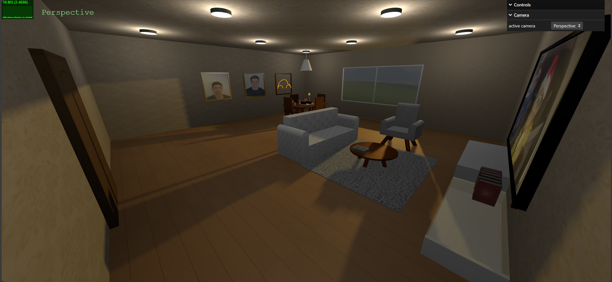
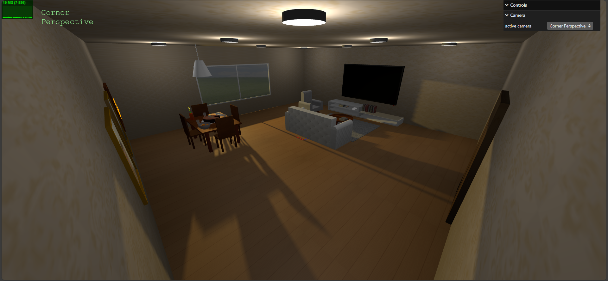

# SGI 2023/2024

## Group T02G07
| Name             | Number    | E-Mail             |
| ---------------- | --------- | ------------------ |
| Daniel Rodrigues         | 202006562 | up202006562@up.pt |
| Tomás Maciel         | 202006845 | up202006845@up.pt |

----

## Projects

### [TP1 - ThreeJS Basics](tp1)

Figure 1: Scene

Figure 2: Scene

#### Description

The [scene](tp1/MyContents.js) aims to mimic a living room where objects are centered around two tables: the dining table and the coffee table. It has some cameras so that we can see it from various perspectives. To achieve this, we have developed the following objects:

- A [table](tp1/objects/MyTable.js) where the following objects are placed:
  - 4 [glass cups](tp1/objects/MyCup.js)
  - A [bowl](tp1/objects/MyBowl.js) with oranges
  - A [dish](tp1/objects/MyDish.js) where our delicious [chocolate cake](tp1/objects/MyCake.js) with [candles](tp1/objects/MyCandle.js) is placed
  - A [jar](tp1/objects/MyJar.js) with a [flower](tp1/objects/MyFlower.js)
  - The latest [journal](tp1/objects/MyJournal.js)

- Around the table, we have a [chair](tp1/objects/MyChair.js) and a [lamp](tp1/objects/MyLamp.js).
- Some [frames](tp1/objects/MyFrame.js) on the wall.
- A [window](tp1/objects/MyWindow.js) that reveals a beautiful landscape.
- A [door](tp1/objects/MyDoor.js) that leads to the outside.
- A [sofa](tp1/objects/MySofa.js) and an [armchair](tp1/objects/MySofa.js) where you can sit and watch the [television](tp1/objects/MyTelevision.js) or read a [book](tp1/objects/MyBook.js).
- A [rug](tp1/objects/MyRug.js) to make the room cozier.
- A [coffee table](tp1/objects/MyCoffeeTable.js).
- A [sideboard](tp1/objects/MySideboard.js) where we have a [remote control](tp1/objects/MyRemote.js) to control the [TV box](tp1/objects/MyCableBox.js) and a [spring](tp1/objects/MySpring.js).
- To brighten up the room, we have several [LED lamps](tp1/objects/MyLed.js) on the ceiling.

#### Important aspects of the developed code

- The dimensions of objects can be tailored by adjusting the parameters in their constructors.
- The size of each object is taken into account when calculating its position in the scene, so the position values are not hard-coded, i.e. you can change the size of the object and it will still be in the same relative position. For instance, the cake will remain on the table if you change its size without having to update the position settings.
- The hierarchy of objects and their corresponding meshes have been built with care.

#### Issues

- Using Bezier curves to make a quarter circle

-----

### [TP2 - ...](tp2)
- (items briefly describing main strong points)

----

### [TP3 - ...](tp3)
- (items briefly describing main strong points)

