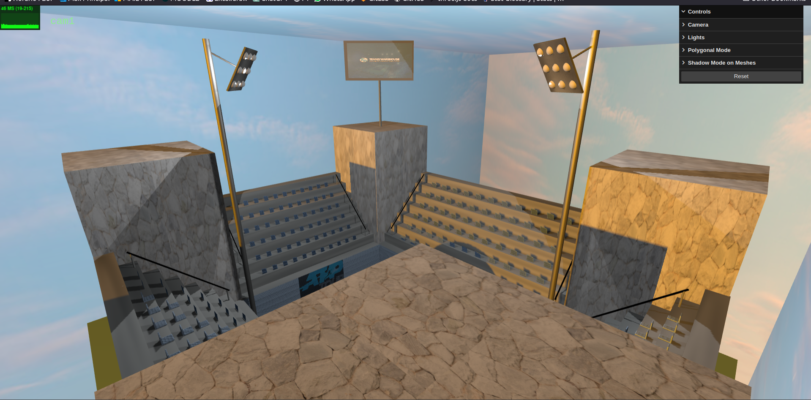

# [TP2 - Graph Scene](tp2)

## Description

The scene developed in YASF mimics a tennis court. It includes two chairs for the players and one larger chair for the referee, four seating stands, a tennis net, a tennis ball, etc.
The work meets all the requirements of the project:
- LODs: the chairs for the players have two levels of detail and the seating stands have three levels of detail.
- Skybox: the scene has a skybox with the texture of a sky.
- Mipmapping: the textures of the ATP logo have mipmaps.
- Bump mapping: the texture of the tennis ball and the court field have bump mapping.
- Video texture: there is a giant screen that shows a video ad of the ATP.
- Wireframe: the user can change the polygonal mode (default, fill, wireframe) in the interface 2D.
- Buffer Geometry: at one level of detail, the seating stands are made with Buffer Geometry.
- Interface 2D: Besides the polygonal mode, the user can also change the camera, the light, and the shadow mode and reset the scene.

## Important aspects of the developed code
An iterative depth-first search (DFS) was implemented to traverse the scene graph, providing more efficiency compared to the recursive DFS approach. The creation process of the scene graph was divided into two phases:

Firstly, establishing the scene graph with solely meshes and transformations.
Subsequently, incorporating material and other attributes inherited.

This approach allows for the utilization of cloning in nodes that share the same meshes but differ in their assigned materials.

## Issues

Converting a recursive DFS to an iterative DFS.