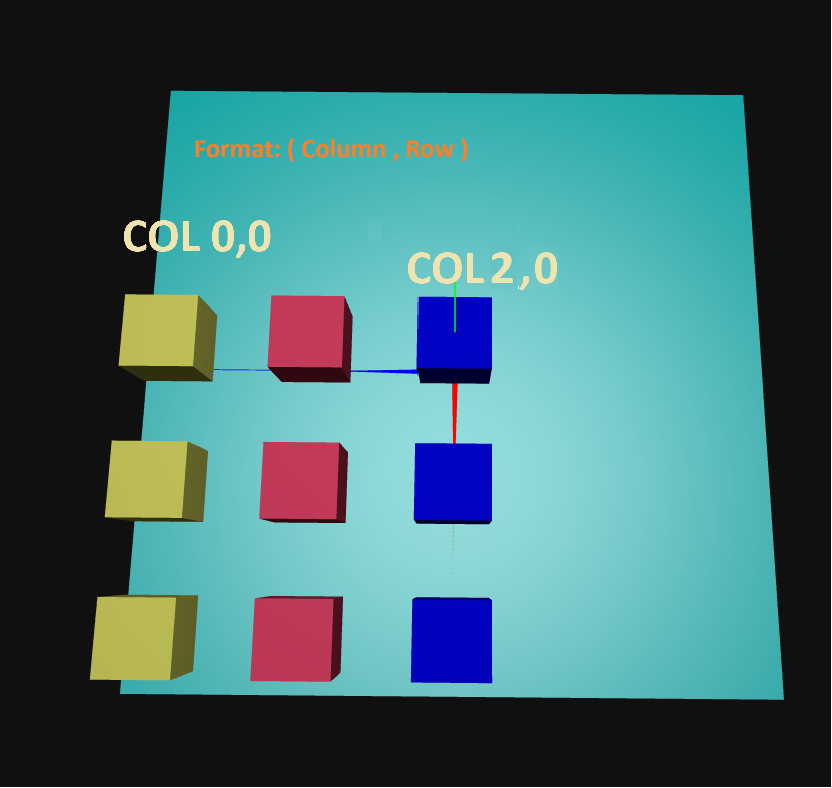
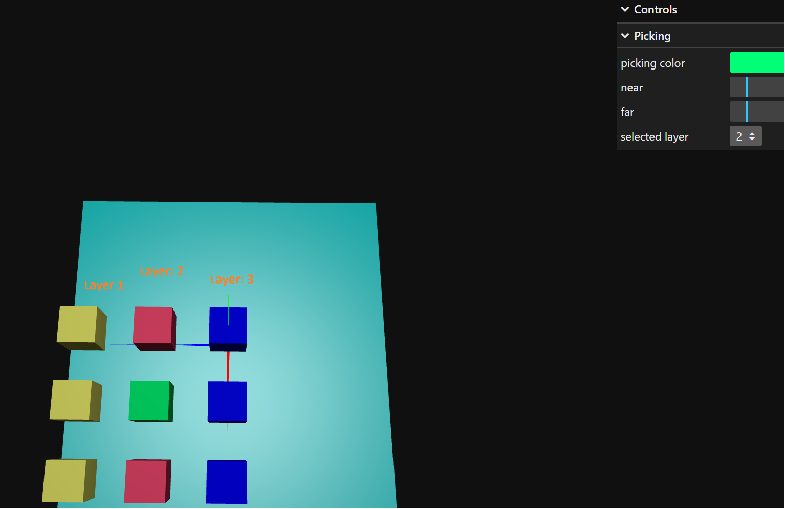

# Picking - Example

The picking is based on fire rays and evaluates the intersected objects.
For this demonstration, it will be used two techniques:
1. filter objects by id
2. layers 

Note: both techniques can be used simultaneously

## Main components

The componentes for picking are the following:

1. register mouse event to detect the cursor position

```js
document.addEventListener(
            "pointermove",
            this.onPointerMove.bind(this),
            false
        );
```

2. define a raycaster and pass as a parameter the mouse coordinates normalized and the active camera

```js
    this.raycaster = new THREE.Raycaster()
    this.raycaster.near = 1
    this.raycaster.far = 20
```

3. process the array with the intersected objects

```js
onPointerMove(event) {

        // calculate pointer position in normalized device coordinates
        // (-1 to +1) for both components

        //of the screen is the origin
        this.pointer.x = (event.clientX / window.innerWidth) * 2 - 1;
        this.pointer.y = -(event.clientY / window.innerHeight) * 2 + 1;

        //set the picking ray from the camera position and mouse coordinates
        this.raycaster.setFromCamera(this.pointer, this.app.getActiveCamera());

        //compute intersections
        var intersects = this.raycaster.intersectObjects(this.app.scene.children);

        this.pickingHelper(intersects)

        this.transverseRaycastProperties(intersects)
    }
```


## Technique 1: Select and exclude pickable objects using Object Id

Define a vector with ids to exclude from picking.





1. define what are the objects to be ignored by the raycaster
```js
    // define the objects ids that can't be picked
    this.notPickableObjIds = ["myplane", "col_0_0", "col_2_0"]
```

2. iterate the intersected objects

```js
pickingHelper(intersects) {
         
        //...
        
        const obj = intersects[0].object
        if (this.notPickableObjIds.includes(obj.name)) {
            //...
        }

        //...

    }
```

3. change the color of the first intersected object

```js
    changeColorOfFirstPickedObj(obj) {
        // ...
    }
```   

## Technique 2: Use object layers as a filter for choosing pickable objects

Objects can be assigned to a layer. Then, it possible do use the layer number to filter the objects that can be picked.

In this example, when 'none' is selected on UI, all objects can be picked (except those who are defined on notPickableObjIds array). 




1. when creating a new object using a layer number (0-31)

```js
buildBox(name, color, layer, xpos, ypos, zpos) {

        // ...

        this.boxMesh.layers.enable(layer)
        
        // ...
    }
```

2. Set active the layer 

```js
 updateSelectedLayer() {
        this.raycaster.layers.enableAll()
        if (this.selectedLayer !== 'none') {
            const selectedIndex = this.availableLayers[parseInt(this.selectedLayer)]
            this.raycaster.layers.set(selectedIndex)
        }
    }
```

## References

[Raycaster](https://threejs.org/docs/#api/en/core/Raycaster)

[Layers](https://threejs.org/docs/#api/en/core/Layers)

[Official Documentation - Picking](https://threejs.org/manual/?q=pick#en/picking)