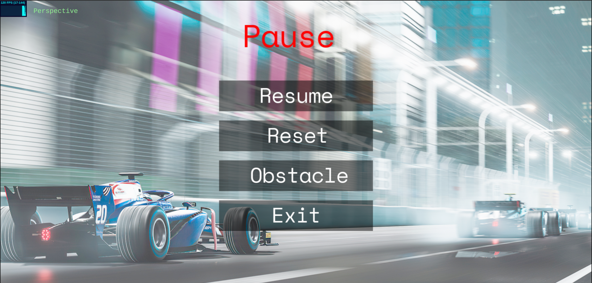

# Manual

## How to run

Make sure you have a server installed to run the application; we recommend using the Visual Studio Extension Live Server. Afterward, open the [index.html](index.html) file using the server.

## Game States

### Main Menu

In this menu, you can see the game's title and the creator's names. 
You can start the game by clicking `Enter`.

### Choose Circuit

In this menu, you can choose the circuit you want to play on. You can add new circuits by adding the name and path to the
xml circuit file in the [circuits.json](scene/circuits.json) file.

### Config Menu

In this menu, you can configure the game's settings, such as the name of the player and the difficulty of the game.
For the name, you can use the keyboard to type your name. For the difficulty, you can use your mouse to select.
After filling the fields, you can proceed by selecting `Next` or go back to the previous menu by selecting `<`.

### Choose Vehicle

In this menu, you can choose the car you want to play with using the mouse. You can add new cars by adding the path to the xml car file in the [vehicles.json](scene/vehicles.json) file. You can also go back pressing `b`. First you choose your vehicle and then you select the opponent's vehicle.

### Game
In the game, you can press `w` to accelerate, `s` to brake, `a` to turn left and `d` to turn right, `ESC` to pause the game, `l` to toggle the car lights and `t`to teleport to the last checkpoint.

### Pause Menu
The pause menu offers options to resume the game, restart it, return to the main menu, or access the 'choose obstacle' state by selecting the corresponding rectangle.

### Choose Obstacle
In this state, you can choose the obstacle you want to add to the circuit. To do so, you can use the mouse to select the obstacle you want to add and then click on the position you want to add it to.

### Game Over
In this menu, you can see who won the game and the time it took to complete the race. You can restart the game or return to the main menu by selecting with your mouse the corresponding rectangle. Enjoy the fireworks and the cars!

